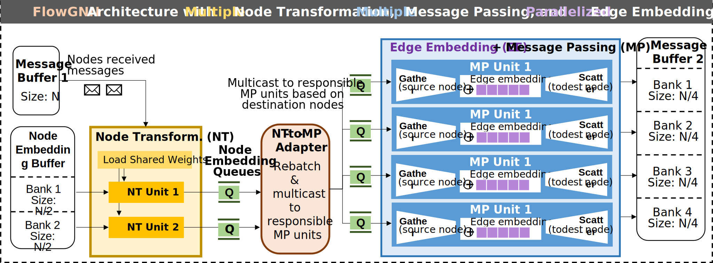

# FlowGNN: A Dataflow Architecture for Universal Graph Neural Network Inference via Multi-Queue Streaming

Rishov Sarkar, Stefan Abi-Karam, Yuqi He, Lakshmi Sathidevi, Cong Hao  
School of Electrical and Computer Engineering, Georgia Institute of Technology

## Overview

This is **FlowGNN**, a generic dataflow architecture for GNN acceleration which can flexibly support the majority of message-passing GNNs. [Read the paper on arXiv.](https://arxiv.org/abs/2204.13103)

Currently, this repository contains prebuilt bitstreams for the Xilinx Alveo U50 FPGA along with supporting host code. Our HLS code will be open-source upon acceptance.
